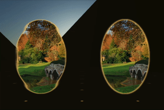

# A-Frame Liquid Portal Shader

<p align="center">
  
  
  <a href="https://travisbarrydick.github.io/aframe-liquid-portal-shader/dist/index.html"> Interactive Demo </a>
</p>

## Description of Effect

This shader adds a ripple effect to an image or video that makes for an effective portal design.

## Installation

You can use `aframe-liquid-portal-shader` in your project in two ways. First, you can simply include the following script tag after the script that loads a-frame:

```html
<script src="https://unpkg.com/aframe-liquid-portal-shader"></script>
```

This will automatically register the shader.

Alternatively, you can install the package using npm by executing

```
npm install aframe-liquid-portal-shader
```

and then in your project you will need to either `include` or `require` the `aframe-liquid-portal-shader` package.

## Example Usage

Once `aframe-liquid-portal-shader` is installed, you can apply the shader to an image or video in your a-frame scene by setting the `material`'s `shader` attribute to be `liquid-portal`. The other parameters of the shader (described below) are also set on the `material` component. For example:

```html
<html>
  <head>
    <title>Liquid Portal</title>
    <script src="https://aframe.io/releases/1.2.0/aframe.min.js"></script>
    <script src="https://unpkg.com/aframe-liquid-portal-shader"></script>
  </head>
  <body>
    <a-scene background="color: #ECECEC">
      <a-assets>
        
      </a-assets>
      <a-image src="#demo" position="0 1.6 -1" material="shader: liquid-portal">
      </a-image>
    </a-scene>
  </body>
</html>
```

## Configurable Parameters

The following parameters can be used to customize the effect. You can play with their values in the <a href="https://travisbarrydick.github.io/aframe-liquid-portal-shader/dist/index.html">interactive demo</a>.

| Parameter         | Type    | Description                                                                                                                                                                                        |
| ----------------- | ------- | -------------------------------------------------------------------------------------------------------------------------------------------------------------------------------------------------- |
| `src`             | `map`   | Texture to display. Can be an image or video.                                                                                                                                                      |
| `rippleCenter`    | `vec2`  | Center of ripple effect (specified in UV coordinates). Default = `{x: 0.5, y: 0.5}`.                                                                                                               |
| `numRipples`      | `float` | The number of ripples along a line of length `0.5` in UV space. When `rippleCenter = {x: 0.5, y: 0.5}` this is the total number of ripples between the center and left or right edge of the image. |
| `maxRippleOffset` | `float` | The maximum displacement caused by the ripples in UV space.                                                                                                                                        |
| `rippleSpeed`     | `float` | The distance moved by each ripple in UV space per second.                                                                                                                                          |

---

This component was developed in partnership with <a href="https://planetvoodoo.org/">Planet Voodoo&reg;</a> (Voodoo LLC) as part of their 'WebXR Wizardry' initiative.

<p align="center">
  <a href="https://planetvoodoo.org/"></a>
</p>
